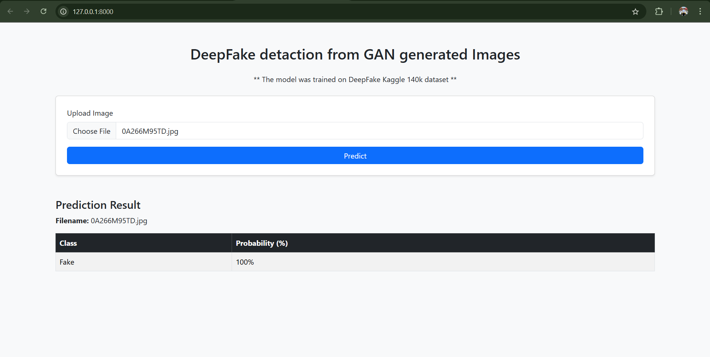

# FastAPI_DeepFake_classification
This is an end-to-end deep learning project to classify DeepFake images. 

## project workflow and description

- collected dataset from [kaggle](https://www.kaggle.com/datasets/xhlulu/140k-real-and-fake-faces)
- preprocessed and clean data
- Augmented the training and validation data
- Train on different CNN architectures, got the best model with 99% accuracy
- Created an api to interact with the model

## setup instruction

### 1. Clone the Repository

```bash
git clone https://github.com/mdparvex/FastAPI_deepFake_classification.git

```

## Setup locally
Create a virtual environment
```bash
python -m virtualenv <environment_name>
```
Activate the virtual environment
```bash
cd <environment_name>\Scripts
activate
```
install requirements.txt
```bash
pip install -r requirements.txt
```

### How to Run the Server
Go to the project root directory and run
```bash
uvicorn app.main:app
```
### Go to the URL
Access it at: http://127.0.0.1:8000/

### Run with Docker
Build the Docker image
```bash
docker build -t deepfake:latest
```
Run the Docker image
```bash
docker run -d -p 8000:8000 deepfake:latest
```

Access it at: http://127.0.0.1:8000/

### API. `POST /predict/`

**Get the prediction by uploading an DeepFake image**

```json
POST /predict/
{
  "file": File
}
```

Returns:

```json
{
    "filename": filename,
    "predictions": predictions,
    "message": "File uploaded successfully"
}
```

---

# Play with the portal
Choose images from the test images folder


